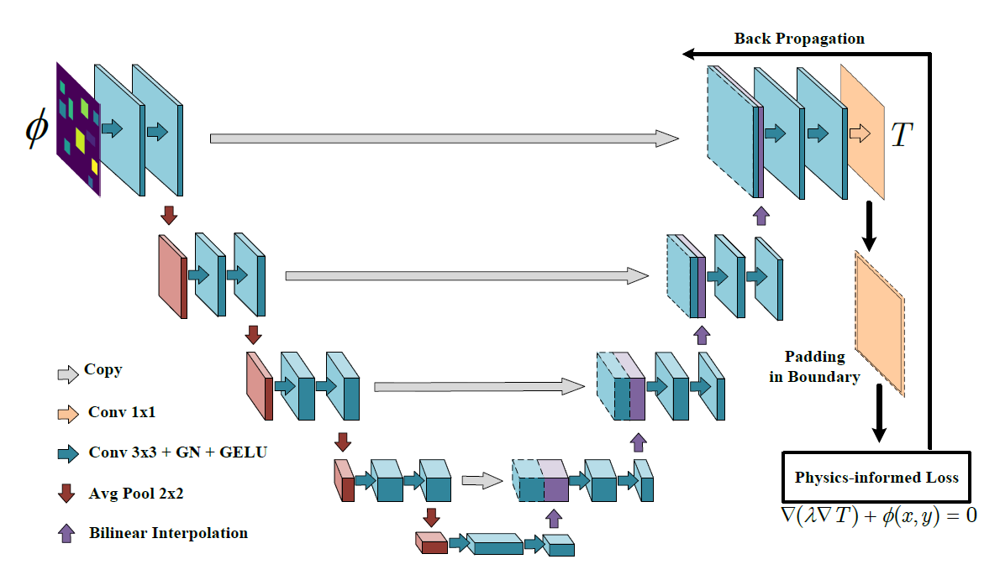
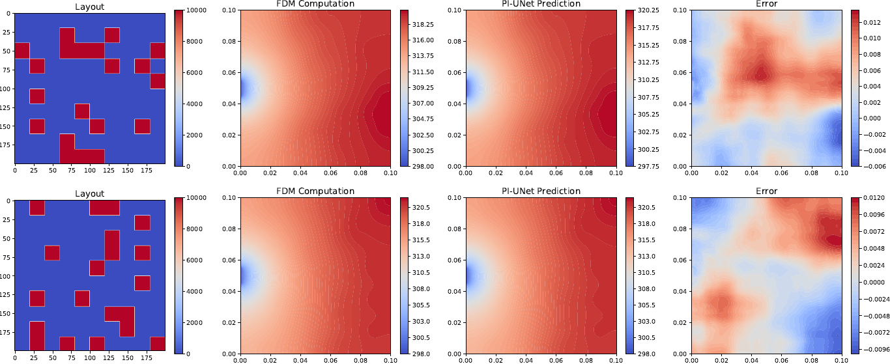
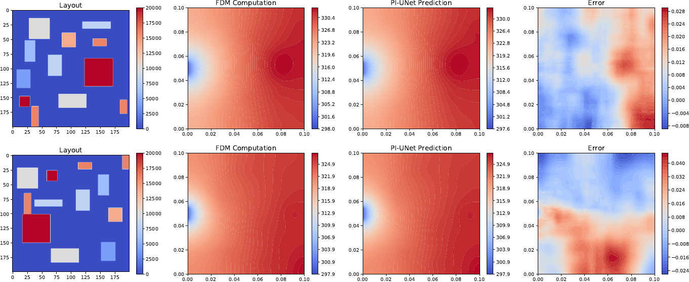

# physics-informed CNN for HSL-TFP
This is the implementation of ‘’Physics-informed convolutional neural networks for temperature field prediction of heat source layout without labeled data“

- the Pipeline of our method.



- The visualization of the steady-state temperature field obtained by finite difference method (FDM) and the proposed method.

The case with simple heat source layout.



- The case with complex heat source layout.



# Usage

## Environment

Note that you need to choose the right version of pytorch-lightning.

```shell
torch=1.12.1+cu113
torchvision=0.13.1+cu113
pytorch-lightning=1.1.0
tensorboard
opencv-python
```

## Data Preparation

- the datasets used in this paper are uploaded to [here](https://nudteducn-my.sharepoint.com/:f:/g/personal/zhaoxiaoyu13_nudt_edu_cn/En4bhHWmNHFEkAs9r06RLl8BD7r7-eBIRph0VilC-axCiA?e=DGzclf). Please download the dataset to your local hard drive, and modify the data address in the configuration file **config_ul.yml**, consisting of the data_root, train_list, val_list, and test_list.

```shell
data_root: /mnt/jfs/zhaoxiaoyu/data/ul/complex_component/FDM
train_list: /mnt/jfs/zhaoxiaoyu/data/ul/train.txt
val_list: /mnt/jfs/zhaoxiaoyu/data/ul/val.txt
test_list: /mnt/jfs/zhaoxiaoyu/data/ul/test.txt
```

## Train and Test

- Train the model without labeled data.

```shell
cd example
python train_ul.py
```

- test the trained model. Please modify the position of trained model in the test.py, and

```shell
python test.py
```

# Citation

If you find our codes or models useful, please consider to give us a star or cite with:

```
@article{zhao2023physics,
  title={Physics-informed convolutional neural networks for temperature field prediction of heat source layout without labeled data},
  author={Zhao, Xiaoyu and Gong, Zhiqiang and Zhang, Yunyang and Yao, Wen and Chen, Xiaoqian},
  journal={Engineering Applications of Artificial Intelligence},
  volume={117},
  pages={105516},
  year={2023},
  publisher={Elsevier}
}
```

